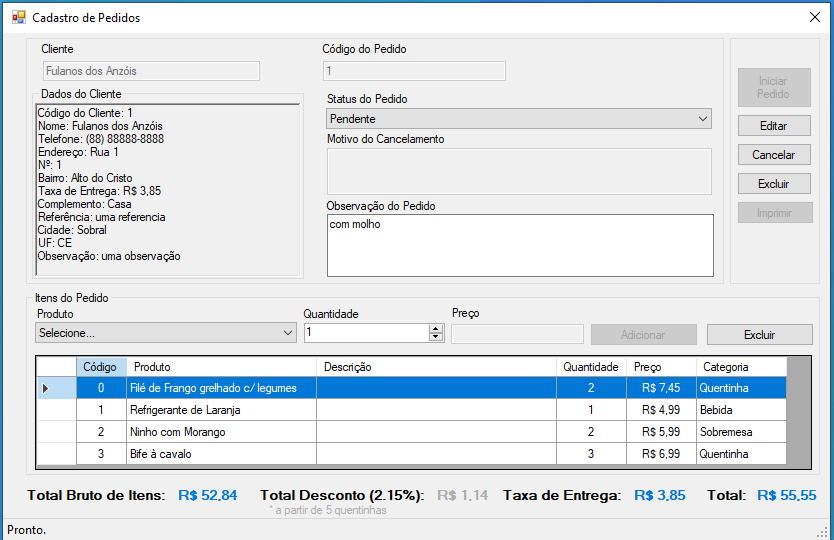
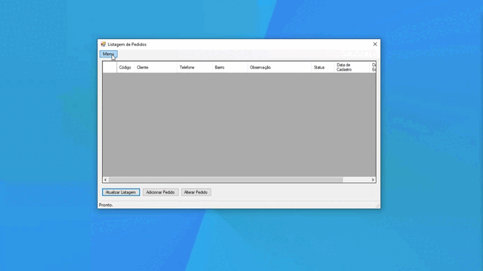
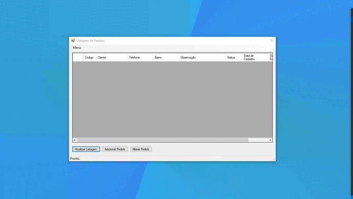
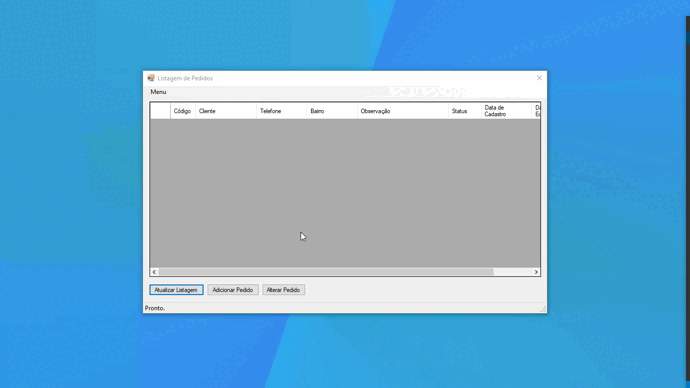

<p align="center" id="top">
    
</p>

<h1 align="center"> Cantina do Tio Bill com .NET Framework C#</h1>

<p align="center">
    <a href="#sobre">Sobre</a> • 
    <a href="#features">Features</a> • 
    <a href="#demo">Demo</a> • 
    <a href="#caso">Caso</a> • 
    <a href="#pre-requisitos">Pré-requisitos</a> • 
    <a href="#tecnologias">Tecnologias</a> • 
    <a href="#licenca">Lincença</a> • 
    <a href="#autor">Autor</a> 
</p>

### Sobre

Cantina Tio Bill é uma aplicação desktop feito com o [Framework .NET ](https://dotnet.microsoft.com/en-us/download/dotnet-framework). Nessa aplicação foi realizado na prática os principais conceitos desse Framework que é um dos mais utilizado no mundo da programação. 

## Caso

A empresa Cantina do Tio Bill está em busca de automatizar o processo de vendas de suas quentinhas. A empresa decidiu contratar você, desenvolvedor, para desenvolver a solução. Ela gostaria de um sistema para gerenciar os seus clientes e as vendas. As seguintes necessidades devem ser levadas em consideração:

- Ela trabalha com mais de um tipo de quentinha
- A partir de 5 quentinhas, a empresa oferece um desconto 2.15%
- A empresa cobra uma taxa variável de entrega
Deve ser possível cancelar um pedido
- Ela gostaria de ter um relatório de suas vendas


### Caracteristicas principais

- [x] Cadastro, edição, exclusão e listagem de clientes
- [x] Cadastro, edição, exclusão e listagem dos bairros com taxa de entrega
- [x] Cadastro, edição, exclusão e listagem dos pratos e produtos
- [x] Cadastro, edição, exclusão e listagem de pedidos
- [x] Cálculo dos valores total + desconto + taxa de entrega

### Demo
<figure align="center">
    
	<figcaption>Cadastro de Bairro e Taxas de entrega</figcaption>
</figure>

<figure align="center">
    
	<figcaption>Cadastro de Produtos</figcaption>
</figure>

<figure align="center">
    
	<figcaption>Cadastro de Clientes</figcaption>
</figure>

<figure align="center">
    
	<figcaption>Cadastro de Pedido</figcaption>
</figure>

<figure align="center">
    
	<figcaption>Modelagem do Banco de Dados</figcaption>
</figure>

### Pre-requisitos

Antes de começar, você vai precisar ter instalado em sua máquina as seguintes ferramentas: [Git](https://git-scm.com/), [Framework .NET ](https://dotnet.microsoft.com/en-us/download/dotnet-framework) e [Sql Server](https://www.microsoft.com/pt-br/download/details.aspx?id=101064). Além disto é bom ter uma IDE para trabalhar com o código como [Visual Studio 2022](https://code.visualstudio.com/)

### 👨🏻‍💻 Rodando o Back End

#### 1. No seu Visual Studio Clone este repositório

```bash
git clone https://github.com/JuniorLima22/cantina-tio-bill-CSharp.git
```

#### 2. Acesse o projeto pela janela gerenciador de soluções

### 💾 Rodando o Banco de Dados

#### 3. Configure suas variáveis ​​de banco de dados no arquivo <code>Conn.cs</code>

```bash
private static string server = "$SERVER";
private static string dataBase = "cantina_tio_bill";
private static string user = "sa";
private static string password = "root";
```

#### 4. Criar um novo esquema no Banco de Dados SQL Server

```bash
# Executar o script SQL dentro do SQL Server 2014 Management em database/cantina_tio_bill.bacpac para criar o banco de dados 'cantina_tio_bill' e as tabelas 'dbo.produto', 'dbo.cliente', 'dbo.bairro', 'dbo.pedido', 'dbo.produto_item', e popular os dados.

```

#### 5. Execute a aplicação no Visual Studio pressione as teclas <code>Ctrl+F5</code>

### Tecnologias

As seguintes ferramentas 🛠 foram usadas na construção do projeto:

<table>
    <tr>
        <td><a href="https://docs.microsoft.com/pt-br/dotnet/csharp/">C#</a></td>
        <td><a href="https://dotnet.microsoft.com/en-us/download/dotnet-framework">Framework .NET</a></td>
        <td><a href="https://docs.microsoft.com/pt-br/sql/sql-server/?view=sql-server-ver15">MS SQL Server</a></td>
    </tr>
    <tr>
        <td>8.0.*</td>
        <td>4.8.*</td>
        <td>2014</td>
    </tr>
</table>

### Referencias

  - Canal no Youtuber [Portal Hugo Cursos](https://youtube.com/playlist?list=PLxNM4ef1BpxjLIq-eTL8mgROdviCiobs9)
  - Canal no Youtuber [Bóson Treinamentos](https://youtube.com/playlist?list=PLucm8g_ezqNoMPIGWbRJXemJKyoUpTjA1)

### Autor

> Made with 💙 by JUNIOR LIMA 👋 [See my LinkedIn](https://www.linkedin.com/in/junior-lima-495108208/) • GitHub [@JuniorLima22](https://github.com/JuniorLima22)

<p align="center">
<sub><a href="#top" align="center">↑ voltar para o topo ↑</a></sub>
</p>